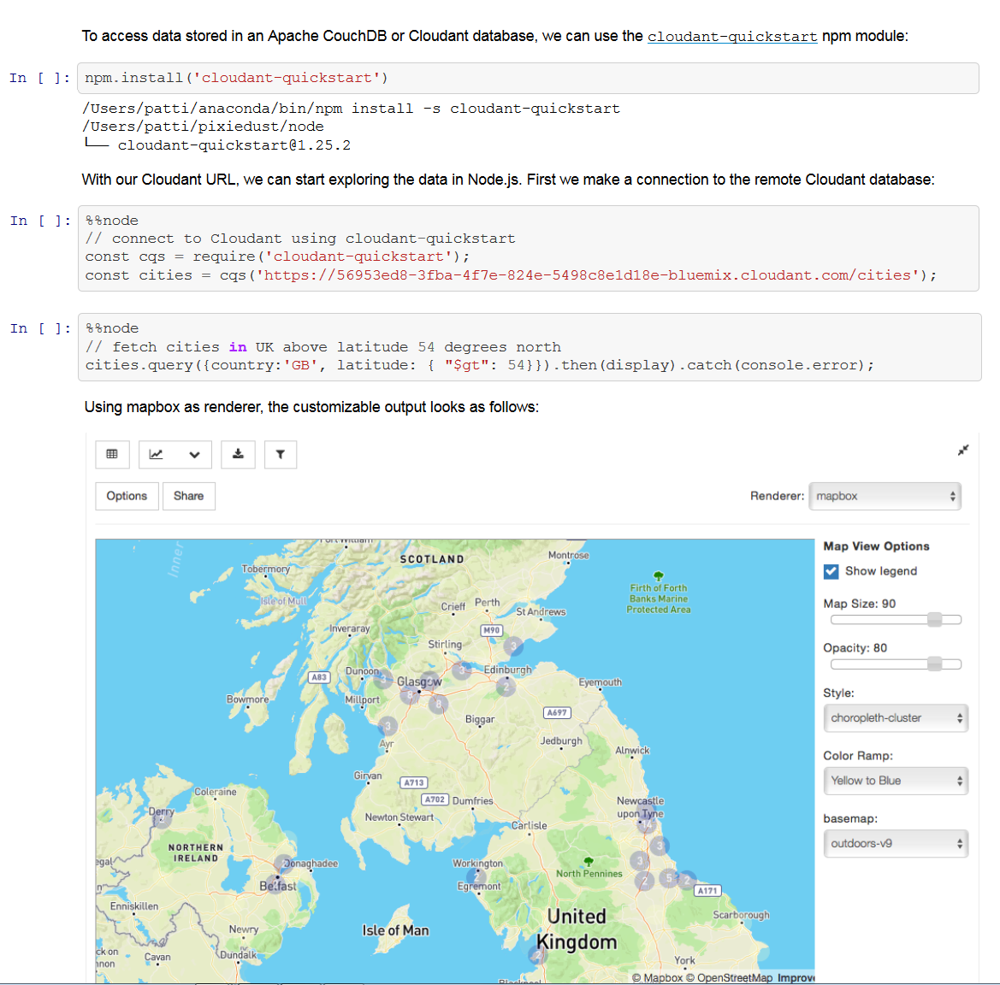
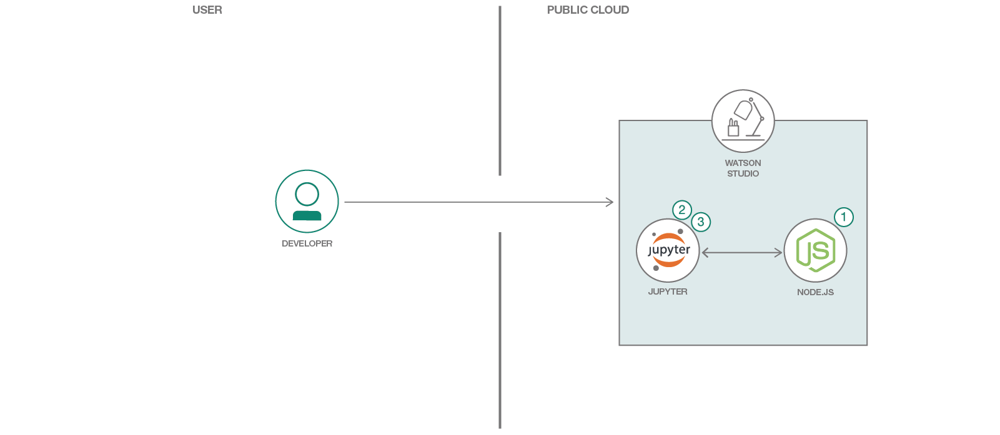
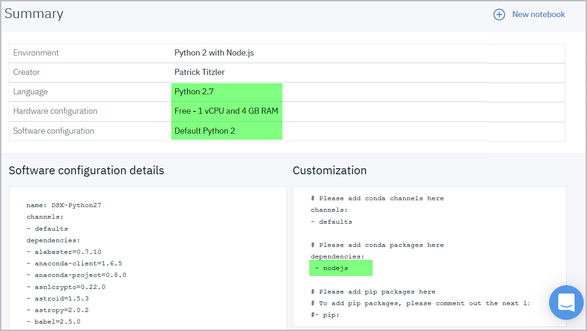
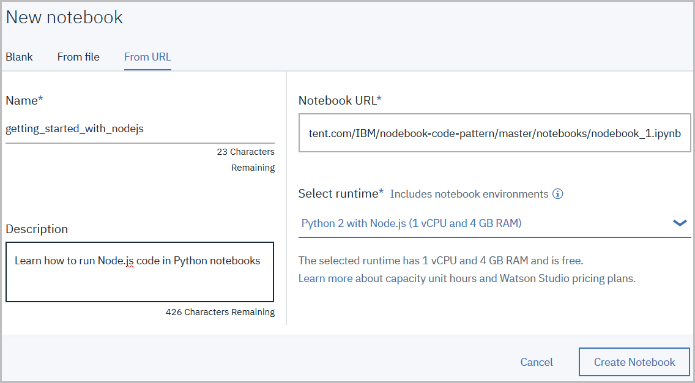

# Run Node.js code in Jupyter notebooks

Notebooks are where data scientists process, analyse, and visualise data in an iterative, collaborative environment. They typically run environments for languages like Python, R, and Scala. For years, data science notebooks have served academics and research scientists as a scratchpad for writing code, refining algorithms, and sharing and proving their work. Today, it's a workflow that lends itself well to web developers experimenting with data sets in Node.js.

To that end, [pixiedust_node](https://github.com/pixiedust/pixiedust_node) is an add-on for Jupyter notebooks that allows Node.js/JavaScript to run inside notebook cells. To learn more follow the setup steps and explore the getting started notebook or click on the sample image below to preview the output.

[](http://nbviewer.jupyter.org/github/IBM/nodejs-in-notebooks/blob/master/data/examples/nodebook_1.ipynb)

When the reader has completed this Code Pattern, they will understand how to:

* Run Node.js/JavaScript inside a Jupyter Notebook
* Use JavaScript variables, functions, and promises
* Work with remote data sources
* Share data between Python and Node.js



## Flow

1. Install Node.js in target environment (Watson Studio or a local machine)
2. Open Node.js notebook in target environment
3. Run Node.js notebook

## Included Components
* [Watson Studio](https://datascience.ibm.com): Analyze data using RStudio, Jupyter, and Python in a configured, collaborative environment that includes IBM value-adds, such as managed Spark.
* [Jupyter Notebook](http://jupyter.org/): An open-source web application that allows you to create and share documents that contain live code, equations, visualizations and explanatory text.
* [PixieDust](https://github.com/pixiedust/pixiedust): Provides a Python helper library for IPython Notebook.
* [Cloudant NoSQL DB](https://console.ng.bluemix.net/catalog/services/cloudant): A fully managed data layer designed for modern web and mobile applications that leverages a flexible JSON schema.

## Featured Technologies
* [pixiedust_node](https://github.com/pixiedust/pixiedust_node): Open source Python package, providing support for Javascript/Node.js code.
* [Node.js](https://nodejs.org/): An open-source JavaScript run-time environment for executing server-side JavaScript code.

# Steps

You can run Node.js code in Watson Studio or your local environment:
* [Run Node.js notebooks in Watson Studio](#cloud)
* [Run Node.js notebooks in a local environment](#real_world)

To preview an example notebook without going through a setup [follow this link](http://nbviewer.jupyter.org/github/IBM/nodejs-in-notebooks/blob/master/data/examples/nodebook_1.ipynb).

## Run Node.js notebooks in Watson Studio
<a name="cloud"></a>

### Creating a custom runtime environment

A runtime environment in Watson Studio (IBM's Data Science platform) is defined by its hardware and software configuration. By default, Node.js is not installed in runtime environments and you therefore need to create a custom runtime environment definition. [[Learn more about environments...]](https://dataplatform.ibm.com/docs/content/analyze-data/notebook-environments.html)

 * Open [Watson Studio](https://datascience.ibm.com) in your web browser. Sign up for a free account if necessary.
 * [Create a "Complete" project.](https://dataplatform.ibm.com/projects?context=analytics) [[Learn more about projects...]](https://dataplatform.ibm.com/docs/content/manage-data/manage-projects.html)
 * In this project, open the **Environments** tab. A list of existing environment definitions for Python and R is displayed.
 * Create a new environment definition.
   * Assign a name to the new environment definition, such as `Python 2 with Node.js`.
   * Enter a brief environment description.
   * Choose the desired hardware configuration, such as a minimalist free setup (which is sufficient for demonstration purposes).
   * Select Python 2 as _software version_. (Python 3 is currently not supported by pixiedust_node.)
   * `Create` the environment definition.
 * Customize the software definition.  
   * Add the [nodejs conda package](https://anaconda.org/anaconda/nodejs) dependency, as shown below:
     ```
     # Please add conda channels here
     channels:
     - defaults

     # Please add conda packages here
     dependencies:
     - nodejs

     # Please add pip packages here
     # To add pip packages, please comment out the next line
     #- pip:
     ```
   * `Apply` the customization. It should look as follows:
 
     
    
  You can now associate notebooks with this environment definition and run Node.js in the code cells, as illustrated in the getting started notebook. 
  > Note: An environment definition is only available within the project that it was defined in. 
   
### Loading the getting started notebook

The [getting started notebook](notebooks/nodebook_1.ipynb) outlines how to
   * use variables, functions, and promises,
   * work with remote data sources, such as Apache CouchDB (or its managed sibling Cloudant),
   * visualize data,
   * share data between Python and Node.js.
   
In the project you've created, add a new notebook _from URL_:
  * Enter any notebook name.
  * Specify remote URL `https://raw.githubusercontent.com/IBM/nodebook-code-pattern/master/notebooks/nodebook_1.ipynb` as source.
  * Select the custom runtime environment `Python 2 with Node.js.` you've created earlier. 

    

Follow the notebook instructions.
> You should be able to run all cells one at a time without making any changes. Do not use run all.

***
<a name="real_world"></a>
## Run Node.js notebooks in a local environment

### Prerequisites
To get started with nodebooks you'll need a local installation of
 
 * [PixieDust and its prerequisites](https://pixiedust.github.io/pixiedust/install.html)
 * A Python 2.7 kernel with Spark 2.x. (see section *Install a Jupyter Kernel* in [the PixieDust installation instructions](https://pixiedust.github.io/pixiedust/install.html))
 * [Node.js/npm](https://nodejs.org/en/download/)


### Installing the samples

To access the samples, clone this repository and launch a Jupyter server on your local machine.

```
$ git clone https://github.com/IBM/nodejs-in-notebooks.git
$ cd nodejs-in-notebooks
$ jupyter notebook notebooks/
```

### Running the samples

Open [nodebook_1](notebooks/nodebook_1.ipynb) to learn more about

 * using variables, functions, and promises,
 * working with remote data sources, such as Apache CouchDB (or its managed sibling Cloudant),
 * visualizing data,
 * sharing data between Python and Node.js.

> You should be able to run all cells one at a time without making any changes. Do not use run all.

***

## Optional data source customization

Some of the nodebook code pattern examples access a read-only Cloudant database for illustrative purposes. If you prefer you can create your own copy of this database by replicating from remote database URL `https://56953ed8-3fba-4f7e-824e-5498c8e1d18e-bluemix.cloudant.com/cities`. [[Learn more about database replication](https://developer.ibm.com/clouddataservices/docs/cloudant/replication/)...]

# Sample Output
<a name="preview"></a>

Open [this link](http://nbviewer.jupyter.org/github/IBM/nodejs-in-notebooks/blob/master/data/examples/nodebook_1.ipynb) to preview the completed notebook.

# Links
* [pixiedust_node](https://github.com/pixiedust/pixiedust_node)
* [pixiedust](https://github.com/pixiedust/pixiedust)
 * [Nodebooks: Introducing Node.js Data Science Notebooks](https://medium.com/ibm-watson-data-lab/nodebooks-node-js-data-science-notebooks-aa140bea21ba)
 * [Nodebooks: Sharing Data Between Node.js & Python](https://medium.com/ibm-watson-data-lab/nodebooks-sharing-data-between-node-js-python-3a4acae27a02)
 * [Sharing Variables Between Python & Node.js in Jupyter Notebooks](https://medium.com/ibm-watson-data-lab/sharing-variables-between-python-node-js-in-jupyter-notebooks-682a79d4bdd9)

# Learn more
* **Watson Studio**: Master the art of data science with IBM's [Watson Studio](https://datascience.ibm.com/)
* **Data Analytics Code Patterns**: Enjoyed this Code Pattern? Check out our other [Data Analytics Code Patterns](https://developer.ibm.com/code/technologies/data-science/)
* **With Watson**: Want to take your Watson app to the next level? Looking to utilize Watson Brand assets? [Join the With Watson program](https://www.ibm.com/watson/with-watson/) to leverage exclusive brand, marketing, and tech resources to amplify and accelerate your Watson embedded commercial solution.

# License

This code pattern is licensed under the Apache Software License, Version 2.  Separate third party code objects invoked within this code pattern are licensed by their respective providers pursuant to their own separate licenses. Contributions are subject to the Developer [Certificate of Origin, Version 1.1 (DCO)] (https://developercertificate.org/) and the [Apache Software License, Version 2] (http://www.apache.org/licenses/LICENSE-2.0.txt).

ASL FAQ link: http://www.apache.org/foundation/license-faq.html#WhatDoesItMEAN